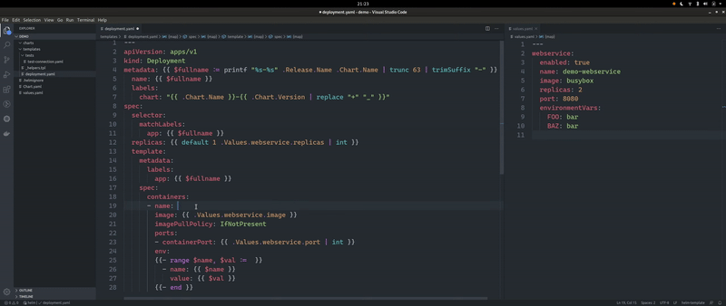

# Helm-Intellisense

- This simple extension provides intellisense for helm-templates. The `values.yaml` file of the chart will be read and evaluated automatically to provide intellisense.
- The extension is compatible with the `Kubernetes` extension.
- Working with language type  `yaml` and `helm-template`

## Extension Settings

This extension contributes the following settings:

* `helm-intellisense.customValueFileNames`: Defines list of possible files containing values(default: `values.yaml`)